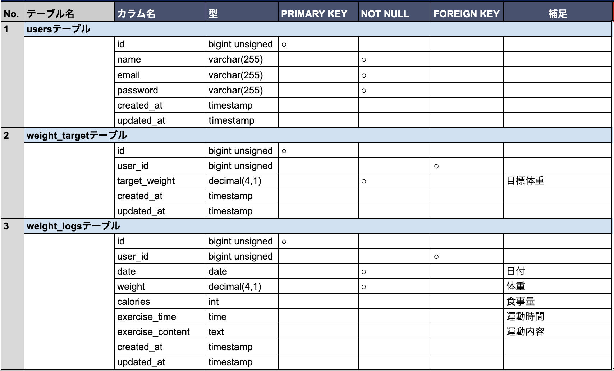
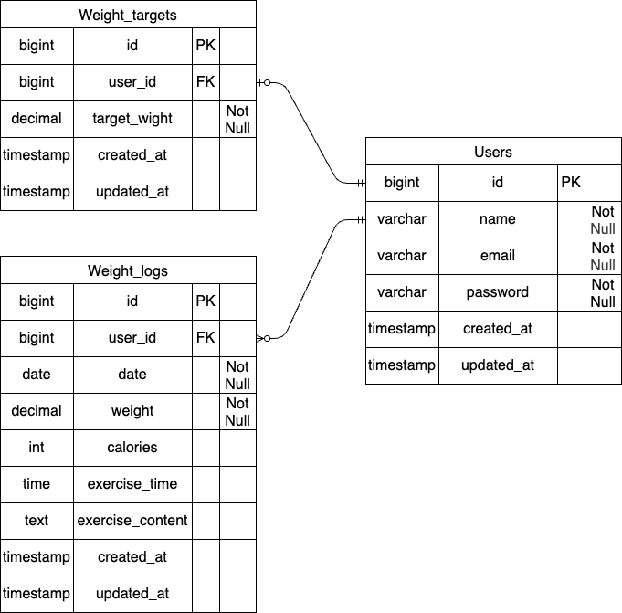

# PiGLy(体重管理アプリ)

## 環境構築
**Dockerビルド**
1. `git clone git@github.com:nekomajin-1017/pigly.git`
2. `cd pigly`
3. DockerDesktopアプリを立ち上げる
4. `docker-compose up -d --build`

**Laravel環境構築**
1. `docker-compose exec php bash`
2. `composer install`
3. 「.env.example」ファイルを 「.env」ファイルに命名を変更。または、新しく.envファイルを作成
4. .envに以下の環境変数を追加
``` text
DB_CONNECTION=mysql
DB_HOST=mysql
DB_PORT=3306
DB_DATABASE=laravel_db
DB_USERNAME=laravel_user
DB_PASSWORD=laravel_pass
```
5. アプリケーションキーの作成
``` bash
php artisan key:generate
```

6. マイグレーションの実行
``` bash
php artisan migrate
```

7. シーディングの実行
``` bash
php artisan db:seed
```

**使用技術(実行環境)**
- PHP:8.5.1
- Laravel:8.83.8
- MySQL:8.0.26
- nginx:1.21.1

**テーブル仕様**


**ER図**


**URL**
- ログイン画面：http://localhost/login<br>
　ID：demo@example.com<br>
　パスワード：password
- 詳細/編集画面：http://localhost/weight_logs
- phpMyAdmin:：http://localhost:8080/
